# Witcher Kings 0.12.0

Hi folks,

It's been 7 (!) years since the last release of the mod.
While I personally took a long break from modding, some others forked and continued improving the mod on their side.
This release tries to integrate things together and also includes unreleased stuff I had previously done.
It also updates the expected checksum one last time, to get rid of the warning at startup.

Here are the modders that have contributed to this release:

* Romulien (integration)
* ajjr1996 (history, balancing and lots of testing)
* Forestf90 (TW3 narrative events)
* AureliusRexRegum (magical government)
* Jackzee (history)
* sorianext (history)

Thanks for their time and effort!

For a full list of past contributors and integrated work, refer to credits.txt in the mod files.

If you want to contribute to the mod, get in touch with us via https://github.com/dworschak/Witcher.

## During this time...

Much has happened in the Witcherverse in these past 7 years - a new book, many TV series, ... and a surprise remaster of The Witcher 3!
As well as an upcoming DLC and an announced Witcher 4 sequel.

On Crusader Kings side, CK2 updates stopped and the game & this mod became free to play forever!
CK3 was released soon after, and its major systems (most recently religion and economy) are still being massively refactored 6 years later. Feels like déjà vu. 

But let's come back to the mod changes in this release.

## TW3 bookmark story events

The Fate of the North (1275) bookmark has graduated to the front page:

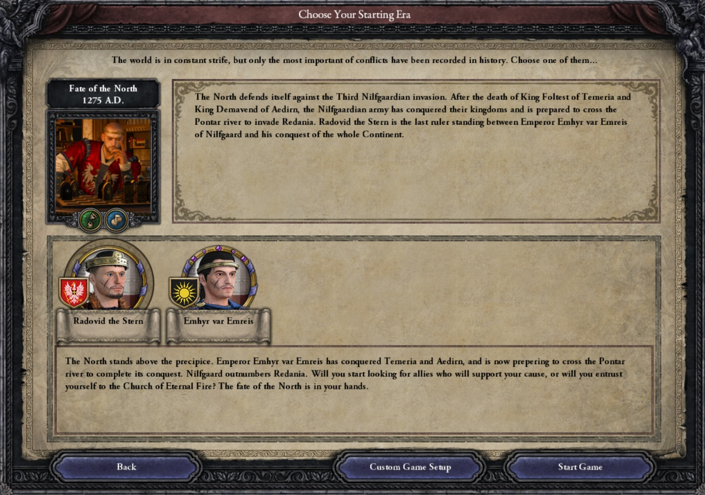

Forestf90 scripted a narrative event chain when playing as Radovid.
It impacts the 3rd Northern War itself but also the peace treaty outcome if Redania wins.

The first branch focuses on diplomacy and impacts the future of Temeria as an independent state:

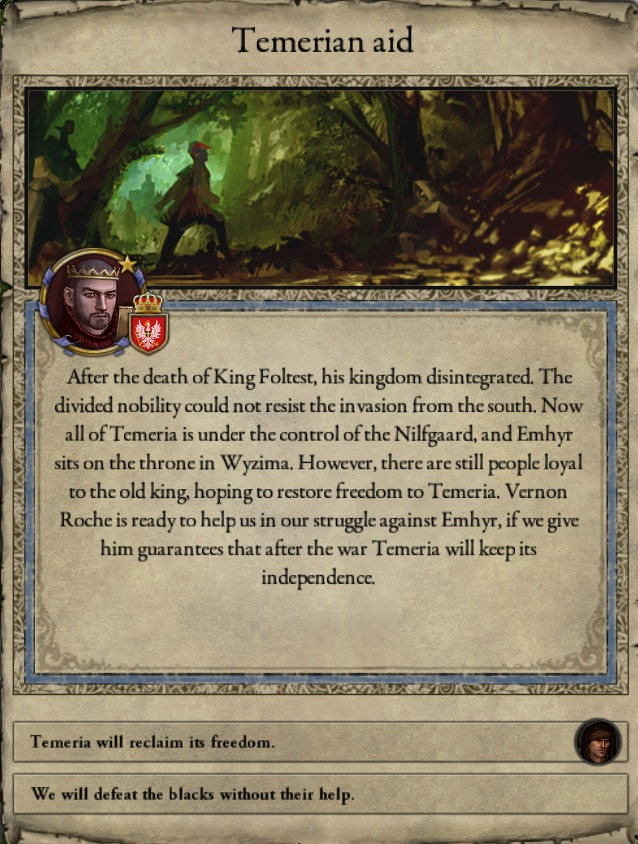

The second branch focuses on religion and fanaticism:

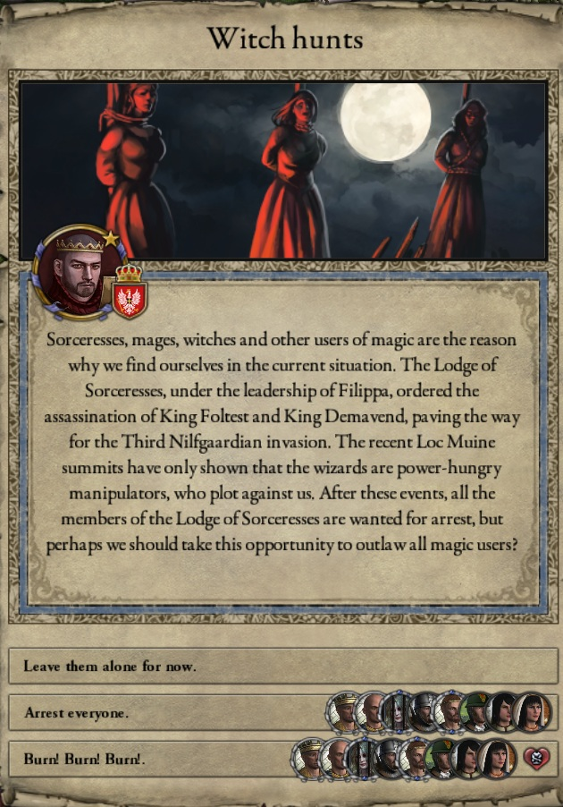

## Northern Reconquest CB for e_the_north

There was a decision to form a Northern Empire, once you control 3 of the northern major kingdoms.

We've added a special CB to make other kingdoms become de jure of the newly formed empire:

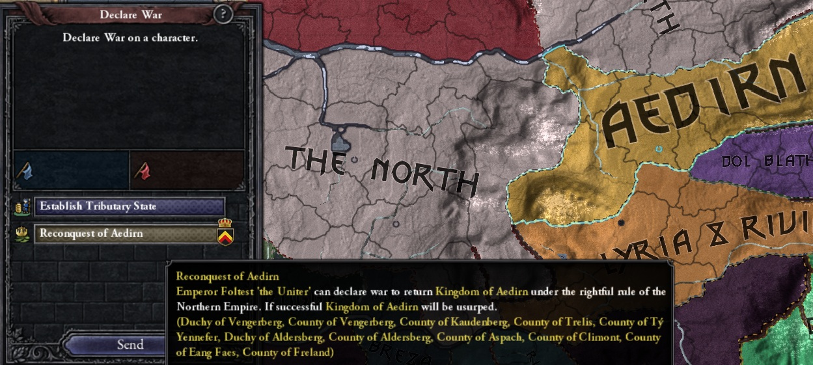

Similarly, we've tweaked the non-human reclamation casus belli  to only be usable once the Hen Caerme or the Dwarf Empire have been formed.

## Interface modding

In one of the last CK2 patches, Paradox has given modders the ability to select the interface per religion, including interfaces that were previously DLC-locked.

So even though all religions are still playable without any DLC, they will have a distinct feel.

Elven religions use the zoroastrian_interface:

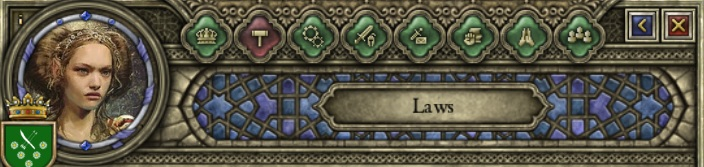

Freya, Druidic and Dryad use the pagan_interface:

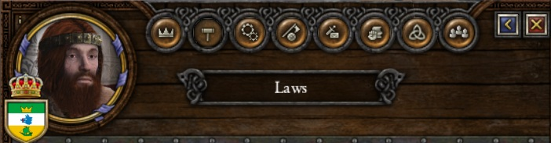

Other northern religions use the hellenic_interface:

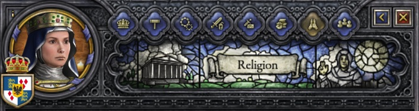

## Magic academies government

Magic academies and mage towers have always been a fight to mod within the CK2 engine.

* Magic academies are barony or county temples associated with a titular duchy. They are inherited randomly by another sorcerer in their court.
* Magic towers are counties with a special "magic" culture. They are inherited by the wilderness, until another mage decides to occupy them.

In the past we've had issues with them reverting to feudal government and succession over time.
We want to simulate that rulers would not risk interacting with sorcerers as they would do for any other vassal.
It also ties to the difficulty of simulating the threat that combat magic poses in wars against sorcerers using the CK2 engine and making the AI understand that.

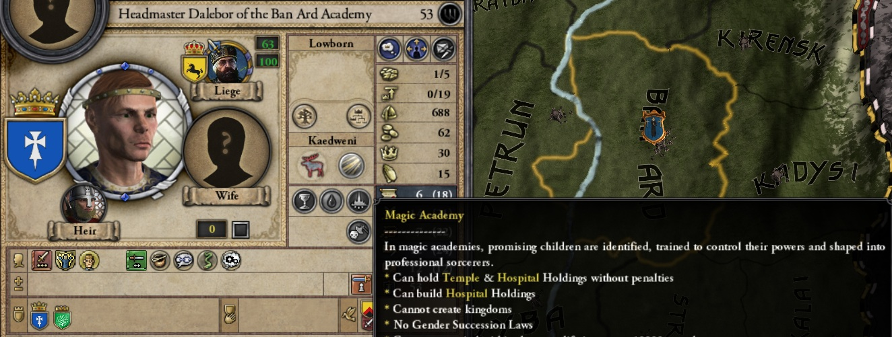

We seem to have found a solution, with a mix of:

* Dedicated magic governments, to prevent usurpation and avoid any liege penalties. 
These governments are still non-playable.
* A hidden trait given to magic academy headmasters to increase opinion with their liege. 
This reduces the likelihood of title revocation by the AI.
* Block the barony & county de jure CBs for these titles

The Nilfgaard Imperial Magic Academy now has its own barony in the Loc Grim province, replacing the previous building:

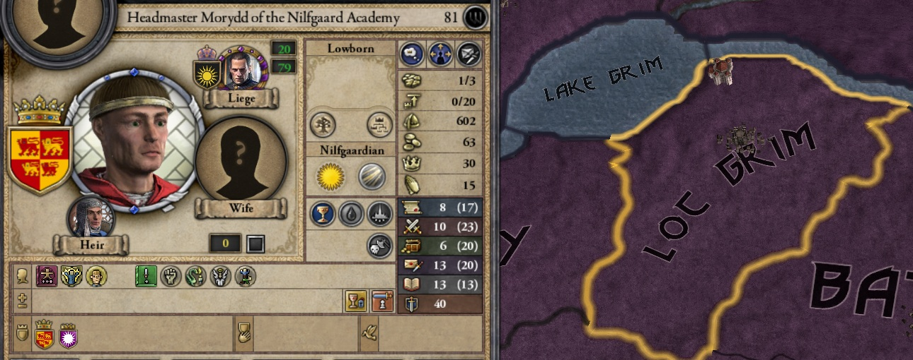

## Reduce long-lived races bloating & madness

Another long-time issue has been modding immortal races with the CK2 engine and vanilla events.
The game is designed to handle a massive number of events on a large number of mortal characters, but it has its limits.

Long-lived races are modded as immortal characters who become "old" via events once they reach a certain age depending on their race.
However, immortal characters are considered important in vanilla and are excluded from the normal pruning.
Thus those characters accumulate over time, when they reproduce or when vanilla events generate new ones with the same ethnicity as their liege.
The problem became even more apparent once CK2 introduced the concept of court limit, causing penalties in the courts of long-lived races.

The following solutions seem to have helped a lot:

* Restrict Dryad reproduction to rulers only and slow Dryad reproduction when court is crowded
* Add fertility reduction per birth for dwarves, gnomes and halfling. 
It is slightly smaller than the one for elves, given their reduced lifespan.
* Increase slightly the fertility reduction via old age modifier.
Remove the event for fertility reduction past age 50, as it was redundant with the menopause modifier.

Their courts are still more crowded than human courts, but it stays under the limit and won't slow the game as much.
For instance, Tir Tochair court size is 44 after 140 in-game years:

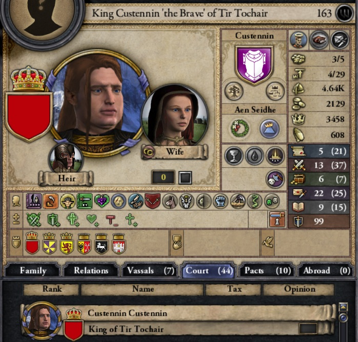

Another side effect of long-lived races was that most characters were becoming lunatic, possessed and depressed.
This was especially visible on sorcerers after a few hundred years.

The health events weights have now been adjusted to the lifespan of non-human races.
Here are the oldest living sorcerers after a little more than 100 in-game years:

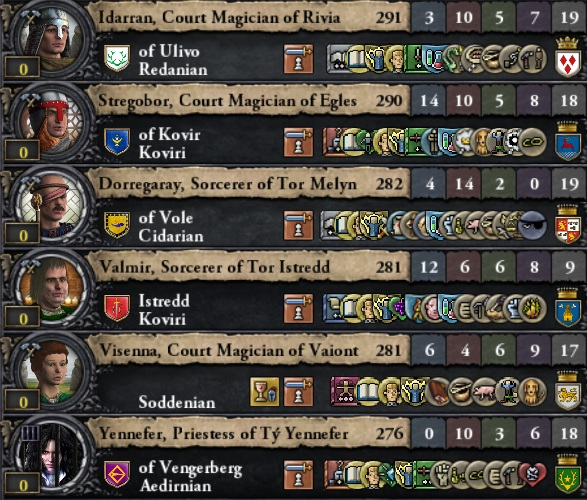

## Known issues

* Alchemist guild members have some white makeup on their portraits ?!
* Skellige "Clan elective" kingdom succession behaves weirdly regarding duchy titles
* Random worlds scenarios may be buggy (no witchers or sorcerers etc).